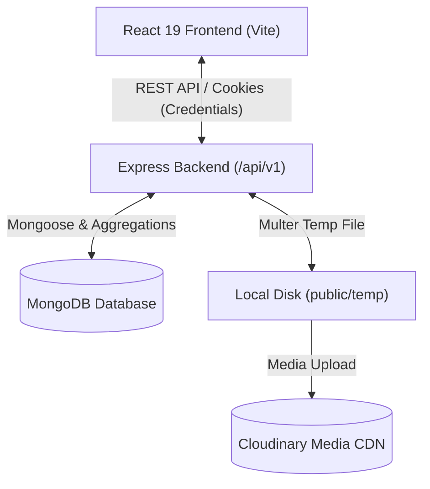

# 🎬 VividStream

A full-stack, production-grade video streaming and creator platform built with the **MERN** stack (MongoDB, Express, React 19, Node.js) with Cloudinary media storage, JWT-based secure authentication, and MongoDB aggregation pipelines.

---

## 📑 Table of Contents

- [Overview](#-overview)
- [Tech Stack](#-tech-stack)
- [Key Features](#-key-features)
- [Project Architecture](#-project-architecture)
- [Folder Structure](#-folder-structure)
- [Getting Started](#-getting-started)
  - [Prerequisites](#prerequisites)
  - [Backend Setup](#backend-setup)
  - [Frontend Setup](#frontend-setup)
- [Environment Variables](#-environment-variables)
- [API Reference](#-api-reference)
- [Design Decisions & Architecture](#-design-decisions--architecture)
- [License](#-license)

---

## 🌟 Overview

**VividStream** is a modern video sharing platform inspired by YouTube, designed with a backend-first architecture. It supports media uploads (video & images) via Cloudinary, real-time community engagement (likes, comments, tweets, subscriptions), playlist management, watch history tracking, and an analytics dashboard for creators.

---

## 🛠 Tech Stack

### Frontend
- **Framework & Build**: [React 19](https://react.dev/), [Vite](https://vitejs.dev/)
- **Routing**: [React Router v7](https://reactrouter.com/)
- **State Management**: [Zustand](https://github.com/pmndrs/zustand) (auth persistence & session state)
- **Forms**: [React Hook Form](https://react-hook-form.com/)
- **Styling**: [SCSS / Sass Embedded](https://sass-lang.com/) (modular, component-based styling)
- **HTTP Client**: [Axios](https://axios-http.com/) (with interceptors & cookie credentials)
- **UI & Notifications**: [React Icons](https://react-icons.github.io/react-icons/), [React Toastify](https://fkhadra.github.io/react-toastify/)

### Backend
- **Runtime & Framework**: [Node.js](https://nodejs.org/) (ES Modules), [Express 5](https://expressjs.com/)
- **Database & ODM**: [MongoDB](https://www.mongodb.com/), [Mongoose 8](https://mongoosejs.com/)
- **Pagination & Queries**: `mongoose-aggregate-paginate-v2` & custom MongoDB aggregation pipelines
- **Authentication**: JSON Web Tokens (JWT Access & Refresh tokens), `bcryptjs`, `cookie-parser`
- **File Handling & Storage**: [Multer](https://github.com/expressjs/multer) (local temporary buffer) & [Cloudinary](https://cloudinary.com/) (cloud media storage)
- **CORS**: `cors` configured with credentials for cookie exchange

---

## 🚀 Key Features

### 🔐 Authentication & User Management
- Secure user registration with avatar and cover image uploads.
- Access & Refresh token rotation with `HttpOnly` secure cookies and `Authorization` header fallback.
- Profile management (update account details, update avatar/cover image, change password).
- Channel profile page displaying subscriber counts, subscribed channels, and channel videos.

### 🎥 Video Management & Playback
- Video upload with custom thumbnails, title, and description.
- Video playback player with real-time view count tracking.
- Video updating (title, description, thumbnail) and deletion.
- Toggle publish / unpublish status.
- Video list with pagination, search queries, and sorting (by views, creation date).

### 💬 Social & Community Engagement
- **Likes**: Like and unlike videos, comments, and community tweets.
- **Comments**: Full CRUD on video comments (add, edit, delete, list with author details).
- **Subscriptions**: One-click channel subscribe/unsubscribe toggle and subscriber counts.
- **Community Tweets**: Creator microblogging / tweet feed with like counters and timeline.

### 📁 Playlists & Collections
- Create custom playlists with title and description.
- Add and remove videos from playlists.
- Fetch user playlists and dedicated playlist detail views.

### 🕒 Watch History & Liked Videos
- Automated watch history tracking (most recent first).
- Dedicated Liked Videos feed for authenticated users.

### 📊 Creator Dashboard
- Channel stats analytics (total video views, subscriber count, total likes).
- Video management table with status toggles and direct actions.

---

## 🏗 Project Architecture



---

## 📂 Folder Structure

```
vivid-stream/
├── backend/
│   ├── public/temp/         # Multer temporary buffer directory
│   ├── src/
│   │   ├── controllers/     # Request handlers (user, video, comment, etc.)
│   │   ├── db/              # MongoDB connection setup
│   │   ├── middlewares/     # Auth (verifyJWT) & upload (multer) middlewares
│   │   ├── models/          # Mongoose schema definitions
│   │   ├── routes/          # Express route definitions
│   │   ├── utils/           # ApiError, ApiResponse, asyncHandler, cloudinary
│   │   ├── app.js           # Express app configuration & middleware pipeline
│   │   ├── constants.js     # DB name & application constants
│   │   └── index.js         # Backend server entry point
│   ├── package.json
│   └── .env.sample
│
├── frontend/
│   ├── public/              # Static frontend assets
│   ├── src/
│   │   ├── api/             # Axios API client functions
│   │   ├── components/      # Reusable UI components & layouts
│   │   │   ├── layout/      # AppLayout, Navbar, Sidebar
│   │   │   └── video/       # VideoCard, VideoPlayer, etc.
│   │   ├── hooks/           # Custom React hooks
│   │   ├── pages/           # Application views (Home, Watch, Channel, etc.)
│   │   ├── routes/          # ProtectedRoute and navigation guards
│   │   ├── stores/          # Zustand state stores (auth.store.js)
│   │   ├── styles/          # Modular SCSS stylesheets
│   │   ├── utils/           # Frontend utility functions
│   │   ├── App.jsx          # Route declarations & auth initialization
│   │   └── main.jsx         # React DOM mount point
│   ├── package.json
│   └── vite.config.js
│
├── PROJECT_CONTEXT.md
└── Readme.md
```

---

## ⚡ Getting Started

### Prerequisites
- [Node.js](https://nodejs.org/) (v18 or higher recommended)
- [MongoDB](https://www.mongodb.com/) (Local instance or MongoDB Atlas URI)
- [Cloudinary Account](https://cloudinary.com/) (Cloud Name, API Key, API Secret)

---

### Backend Setup

1. **Navigate to the backend directory:**
   ```bash
   cd backend
   ```

2. **Install dependencies:**
   ```bash
   npm install
   ```

3. **Configure Environment Variables:**
   Create a `.env` file in `backend/`:
   ```env
   PORT=8000
   CORS_ORIGIN=http://localhost:5173
   MONGODB_URI=mongodb+srv://<username>:<password>@cluster0.mongodb.net
   ACCESS_TOKEN_SECRET=your_access_token_secret_key
   ACCESS_TOKEN_EXPIRES_IN=1d
   REFRESH_TOKEN_SECRET=your_refresh_token_secret_key
   REFRESH_TOKEN_EXPIRES_IN=10d
   CLOUDINARY_CLOUD_NAME=your_cloud_name
   CLOUDINARY_API_KEY=your_api_key
   CLOUDINARY_API_SECRET=your_api_secret
   ```

4. **Start the backend development server:**
   ```bash
   npm run dev
   ```
   Server will run on `http://localhost:8000`.

---

### Frontend Setup

1. **Navigate to the frontend directory:**
   ```bash
   cd frontend
   ```

2. **Install dependencies:**
   ```bash
   npm install
   ```

3. **Configure Environment Variables (Optional):**
   Create a `.env` file in `frontend/` if needed:
   ```env
   VITE_API_BASE_URL=http://localhost:8000/api/v1
   ```

4. **Start the frontend development server:**
   ```bash
   npm run dev
   ```
   Vite will serve the app on `http://localhost:5173`.

---

## 🔑 Environment Variables

### Backend (`backend/.env`)

| Variable | Description | Example |
| :--- | :--- | :--- |
| `PORT` | Port number for Express server | `8000` |
| `CORS_ORIGIN` | Allowed client origin for CORS | `http://localhost:5173` |
| `MONGODB_URI` | MongoDB connection URI | `mongodb+srv://...` |
| `ACCESS_TOKEN_SECRET` | Secret key for signing JWT access tokens | `your_access_token_secret` |
| `ACCESS_TOKEN_EXPIRES_IN` | Expiry duration for access token | `1d` |
| `REFRESH_TOKEN_SECRET` | Secret key for signing JWT refresh tokens | `your_refresh_token_secret` |
| `REFRESH_TOKEN_EXPIRES_IN` | Expiry duration for refresh token | `10d` |
| `CLOUDINARY_CLOUD_NAME` | Cloudinary account cloud name | `your_cloud_name` |
| `CLOUDINARY_API_KEY` | Cloudinary API Key | `1234567890` |
| `CLOUDINARY_API_SECRET` | Cloudinary API Secret | `your_api_secret` |

---

## 📡 API Reference

Base URL: `/api/v1`

### 👤 Users (`/api/v1/users`)
| Method | Endpoint | Description | Auth |
| :--- | :--- | :--- | :---: |
| `POST` | `/register` | Register new user (avatar & cover upload) | ❌ |
| `POST` | `/login` | Authenticate user & set JWT cookies | ❌ |
| `POST` | `/logout` | Invalidate refresh token & clear cookies | ✅ |
| `POST` | `/refresh-token` | Regenerate access & refresh tokens | ❌ |
| `POST` | `/change-password` | Update current user's password | ✅ |
| `GET` | `/current-user` | Fetch currently authenticated user | ✅ |
| `PATCH` | `/update-account` | Update full name and email | ✅ |
| `PATCH` | `/avatar` | Update user avatar image | ✅ |
| `PATCH` | `/cover-image` | Update user channel cover image | ✅ |
| `GET` | `/c/:username` | Fetch channel profile details & subscription status | ✅ |
| `GET` | `/history` | Fetch authenticated user's watch history | ✅ |

### 📹 Videos (`/api/v1/videos`)
| Method | Endpoint | Description | Auth |
| :--- | :--- | :--- | :---: |
| `GET` | `/` | Get published videos (search, paginate, sort) | ✅ |
| `POST` | `/` | Upload video & thumbnail to Cloudinary | ✅ |
| `GET` | `/:videoId` | Get video details, owner, like & subscriber stats | ✅ |
| `PATCH` | `/:videoId` | Update video title, description, or thumbnail | ✅ |
| `DELETE` | `/:videoId` | Delete video from database | ✅ |
| `PATCH` | `/toggle/publish/:videoId` | Toggle publish / unpublish status | ✅ |

### 💬 Comments (`/api/v1/comments`)
| Method | Endpoint | Description | Auth |
| :--- | :--- | :--- | :---: |
| `GET` | `/:videoId` | Get comments for a video (paginated) | ✅ |
| `POST` | `/:videoId` | Add a comment to a video | ✅ |
| `PATCH` | `/c/:commentId` | Update comment content | ✅ |
| `DELETE` | `/c/:commentId` | Delete a comment | ✅ |

### ❤️ Likes (`/api/v1/likes`)
| Method | Endpoint | Description | Auth |
| :--- | :--- | :--- | :---: |
| `POST` | `/toggle/v/:videoId` | Toggle like status on a video | ✅ |
| `POST` | `/toggle/c/:commentId` | Toggle like status on a comment | ✅ |
| `POST` | `/toggle/t/:tweetId` | Toggle like status on a tweet | ✅ |
| `GET` | `/videos` | Get list of videos liked by the current user | ✅ |

### 🔔 Subscriptions (`/api/v1/subscriptions`)
| Method | Endpoint | Description | Auth |
| :--- | :--- | :--- | :---: |
| `POST` | `/c/:channelId` | Toggle subscribe / unsubscribe to a channel | ✅ |
| `GET` | `/c/:channelId` | Get list of subscribers for a channel | ✅ |
| `GET` | `/u/:subscriberId` | Get channels subscribed to by a user | ✅ |

### 📁 Playlists (`/api/v1/playlist`)
| Method | Endpoint | Description | Auth |
| :--- | :--- | :--- | :---: |
| `POST` | `/` | Create a new playlist | ✅ |
| `GET` | `/:playlistId` | Get playlist details and video list | ✅ |
| `PATCH` | `/:playlistId` | Update playlist name and description | ✅ |
| `DELETE` | `/:playlistId` | Delete a playlist | ✅ |
| `PATCH` | `/add/:videoId/:playlistId` | Add a video to a playlist | ✅ |
| `PATCH` | `/remove/:videoId/:playlistId` | Remove a video from a playlist | ✅ |
| `GET` | `/user/:userId` | Get all playlists created by a user | ✅ |

### 🐦 Tweets (`/api/v1/tweets`)
| Method | Endpoint | Description | Auth |
| :--- | :--- | :--- | :---: |
| `POST` | `/` | Post a community tweet | ✅ |
| `GET` | `/` | Fetch all community tweets (feed) | ✅ |
| `GET` | `/user/:userId` | Fetch tweets authored by a specific user | ✅ |
| `PATCH` | `/:tweetId` | Update tweet content | ✅ |
| `DELETE` | `/:tweetId` | Delete a tweet | ✅ |

### 📊 Dashboard & Healthcheck
| Method | Endpoint | Description | Auth |
| :--- | :--- | :--- | :---: |
| `GET` | `/api/v1/dashboard/stats` | Channel stats (views, subscribers, likes) | ✅ |
| `GET` | `/api/v1/dashboard/videos` | Get all videos uploaded by the channel | ✅ |
| `GET` | `/api/v1/healthcheck` | Service health status | ❌ |

---

## 💡 Design Decisions & Architecture

1. **Backend as Source of Truth**: Counts (subscribers, likes, views) and relational statuses are calculated dynamically via optimized MongoDB aggregation pipelines rather than being hardcoded or guessed on the frontend.
2. **Robust Error Handling**: Standardized `ApiError` class and `ApiResponse` envelope ensure consistent status codes, error messaging, and data payloads across all endpoints.
3. **Safe Media Lifecycle**: Multipart uploads are buffered locally to `public/temp` by Multer before being streamed to Cloudinary, with automatic filesystem cleanup on success or error.
4. **Zustand State Persistence**: Lightweight client-side session management that automatically revalidates authentication on startup through `/api/v1/users/current-user`.

---

## 📜 License

This project is licensed under the [ISC License](LICENSE).
